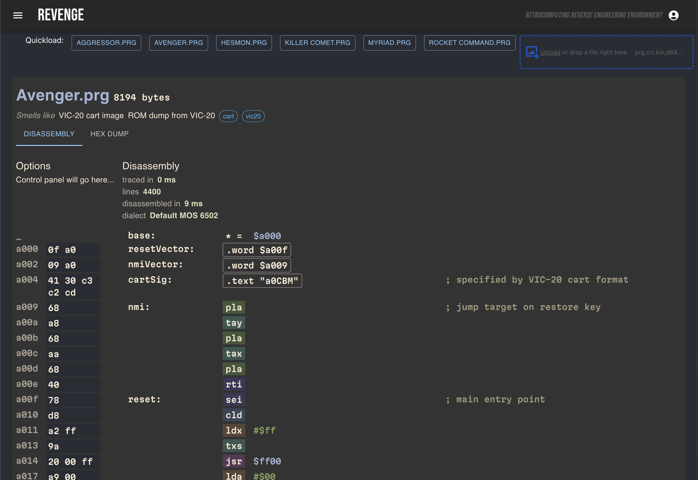

# Revenge

Reverse Engineering Environment


The grand idea is a web-based reverse engineering environment for retro computers
with very small initial goals: binary file type detection and simple disassembly of 
6502 machine code for the Vic-20 and C64. Z80 is a likely future supported architecture.

Beyond the small initial goals lies a vast land of unfulfilled wishes.

**Project Status**: _pre alpha_ (it sort of works with plenty left [TODO](TODO.md))



Using a hybrid approach to code detection, some parts of a binary can be confidently identified
as code through a mixture of static and dynamic analysis. Currently I'm working on a `Tracer`
which follows code execution paths, including both sides of conditional branches and records
which addresses hold instructions. Solving this problem deterministically for all possible 
programs is equivalent to solving
[The Halting Problem](https://en.wikipedia.org/wiki/Halting_problem) which has been famously
proved to be impossible. Solving it deterministically for certain programs, constrained to a
useful subset of possible instructions is at an early stage of implementation and further work
to extend this with partial evaluation and probabilistic execution could be very useful for
accelerating reverse engineering on small retro systems.

Using a combination of preemptive emulation, detailed machine architecture definitions and
static analytic techniques like program transformation, escape analysis, peephole optimisation
and dynamic techniques like speculativeπ partial execution, combined with a large cross-referenced
database built from a corpus of known software, I hope to give insight to a human reverse engineer
about any software written for these enigmatic retro systems.

It may also be useful to use LLMs to help interpret code although I haven't begun to integrate
such a system.

## Architecture

Implemented in [TypeScript](https://www.typescriptlang.org/), using [React](https://react.dev/), 
[Bun](https://bun.sh/), [Vite](https://vite.dev/), [MUI](https://mui.com/) and 
[Mocha](https://mochajs.org/)/[Chai](https://www.chaijs.com/) for testing.

## Quick Start

After checking out this repo, from a shell in the root directory, run the sanity script
to check you have the relevant/recommended tools installed:

```shell
./sanity.sh
```

The main system is a single page web app with an optional server comonent which provides
access to retro binaries stored on the local filesystem a few are included in this
repo. Without the server, you can drag and drop files from your computer into the browser or click
the upload button.

To run the server in its own shell, make sure you're in the `server` dir:

```shell
cd server
bun start
```

To run the client in its own shell, make sure you're in the `client` dir:

```shell
cd client
bun dev
```

The URL to point your browser to is shown in the console.


## System Design

Build and execution environment is `vite` for the client and `bun` for both client and server.
Node should also work with `npm` or `pnpm`. I'm not sure how to structure the project to be
transparently agnostic about this but if you have opinions and skills, get in touch and I will
accommodate any sane suggestions. To use `npm` or `pnpm`, check the `client/package.json` and
`server/package.json` files to see what scripts are defined.


## Features

* drag and drop file loading
* load file contents into summary view
* hex view (minimal)
* dumb disassembly - detection of code vs data is a project goal
* file type recognition
  * can recognise at least two types and offer to disassemble if it knows how
  * vic20 raw cartridge image recognition
  * BASIC programs
* representation of a syntax-independent assembler pseudo-op and Dialect can implement
  syntax-specifics
* assembly syntax highlighting
* Test suite
* Decode BASIC programs on VIC-20 and C64
* High quality reference data from the [c64ref](https://github.com/mist64/c64ref) project, initiated
  by [Michael Steil](https://pagetable.com/) of
  [The Ultimate C64 Talk](https://youtu.be/ZsRRCnque2E) fame.
* stats/summary of file interpretation action taken
  * execution time for disassembly
  * symbol detection count (disassembly)
* System kernal subroutine symbol recognition (VIC-20, C64)

## System Support Status

The design aims to reduce the effort of supporting multiple different systems, however at this
stage only VIC-20 and C64 carts, prg files and BASIC files have been tested and there is no
comprehensive test suite yet. Also, I'm not sure how feasible it would be to support some systems.
Within the communities of each system, different assembler tool chains are more prevalent.

In general, project scope includes support for 6502-based and Z80-based 80s Microcomputers and a
generous subset of the more common assembler syntax dialects. The following table shows
estimations, not promises.

| Machines                     | Status      | CPU Family |
|------------------------------|-------------|------------|
| VIC-20, C64                  | In Progress | 6502       |
| Apple II, BBC B              | Planned     | 6502       |
| NES                          | Probable    | 6502       |
| ZX Spectrum                  | Planned     | Z80        |
| Microbee, TRS-80             | Probable    | Z80        |
| Oric, Atari 8-bit            | Probable    | 6502       | 
| VZ-200 / VZ-300 / Laser      | Probable    | Z80        |
| SNES                         | ?           | 6502       |
| Gameboy series               | ?           | Z80 -ish   |
| Vectrex, TRS-80 Coco, Dragon | ?           | 6809       |

## Design Notes

Machine language BASIC loaders often use base 10 data sequences of bytes. This is a
low compression format. Higher radix formats can be used as strings, rem comments or
some other transport format and the encoding of the instruction data can be a custom,
variable-length compression format.

Peep-hole optimiser.
See [documented optimisations](https://www.nesdev.org/wiki/6502_assembly_optimisations).

Patchy comprehensions - in a given disassembly, is the byte literal treated as a
zero-page address? If so, or if it is a 16-bit address for, say, a load or store,
is there some kernal symbol for that address or is it a JSR destination?

Run small trial executions in the background to score various areas as code or data.
Detect code sequences that modify code (self-modifying code is harder to understand,
although if the only change during simulation is to a memory address that is read from,
and not thereafter jumped to or used as an index for a branch, signs point to likely
separation between code and data).

Try to make this multipronged analysis somewhat automatic so the user can just
confirm simple hunches or heuristic interpretations.

### Pattern Recogniser and Macro Synthesiser

* The long conditional branch, [64tass supports it](https://tass64.sourceforge.net/#branch-long)
* Register stack save, restore
* Infinite unconditional loop
* Block of zeroes
* Block of pattern repeat

### Canonicalisation

There are different ways to represent data and code which are equivalent. A canonical form
functions as a single representation into which any variation can be transformed for the
purpose of deciding equivalence and should help in identifying behaviour, optimisation,
deobfuscation and porting. 

The canonical form of a piece of interpreted data enables divergent yet semantically equivalent
forms to be recognised. In the case of character data, the canonical form might make the reverse
form equivalent. In the case of code, the canonical form will have equivalences that, for example
use the y register instead of the x register, all else being equal. Canonical forms for code may
execute in a different number of cycles or use a different number of bytes or have instructions
in a different order (some design is required to analyse alternate orderings with preservation
of semantics).

## Interactive Disassembly

While as much detection as possible is ideal, detection cannot be perfect and all designation
options should be selectable by the user.

* Mark self-modifying code
* Mark block or line
* Macro extraction
* Expression synthesis
* Symbol definition
* Comments, labels, alternate literal forms including escape characters

## Assembly Dialects

Dialects should define equivalent alternative generation options for particular parts and the user
can choose which
suits the given part. Also, guesses should be smart.

A command line required to assemble the file in a given assembler should be provided in a comment at
the top of the generated output (this implies the filename must also be specified). CPU designation
and, system symbol imports etc. can only be specified on the command line or by environment
variables on some assemblers as opposed to having assembler directives for them. While trying not to
get into OS-specifics, command-lines are necessarily going to be OS-specific.

Within a dialect, different options may be selectable in a config form, so preferred output
styling can be tweaked.

The disassembly of the C64 Kernal and friends

Assembler dialects being considered:

### Vasm "Oldstyle"

[Oldstyle](http://sun.hasenbraten.de/vasm/release/vasm_6.html) is one of the supported dialects in
vasm, Ben Eater's choice.

* Top of docs: http://sun.hasenbraten.de/vasm/release/vasm.html
* Very simple syntax, like ancient 6502 source code
* strict-columnar syntax compared to its _Standard Syntax_
* Within this style, various syntax options are available, as per
  [the documentation](http://sun.hasenbraten.de/vasm/release/vasm_6.html)
  which permit some deviations from the default oldstyle syntax. Of the
  options that affect correct parsing, most vary the syntax towards
  common assembly syntax found in the most popular assemblers such as Kick.

Some noteworthy features of Vasm "oldstyle":

* Supports Z80 but there are a few constraints on certain directives
* Many directives have several variants and aliases
* labels must begin in the first column and the trailing `:` is optional,
  however in Vasm's `Standard` syntax, labels do not have to start on the first
  column but **must** have a trailing `:`, therefore conform to both by
  generating labels at column 0 and always adding the `:`
* Anonymous labels, which can be more legible for local refs
* Section protection - most useful for read-only for carts and roms
* operands must be separated from the mnemonic by whitespace
* line comment prefix is `;`
* hex literals are denoted by a `$` prefix
* PC assignment on 6502 can be done as `* = $12af` (Z80 uses `$`), matching
  general symbol assignment (also `org` form)
* `.addr $1234` is a 16 bit data declaration that respects target endianness
* `.blk $01,$ff` fills 256 bytes with the value $01
* String and word literals
* Binary includes (useful for designated or detected binary blocks like `.sid`
  chunks) or common graphics formats.
* Macro definition and invocation
* `repeat expr` and `endrepeat` will repeat a given block of code `expr` times

### Kick Assembler

[Kick Assembler](http://theweb.dk/KickAssembler/Main.html) by Mads Nielsen is free, although closed
source, it
is free to use and it one of the most popular assemblers in the C64 community mostly for its rich
scripting-language-like assembler directives and macros.

* closed source
* very complex, inconsistent and non-orthogonal syntax variations. The author claims parsers must be
  hand-coded rather than generated.

### Others:

* [64tass](https://tass64.sourceforge.net/)
* [Acme](https://sourceforge.net/projects/acme-crossass/)
* [DASM](https://dasm-assembler.github.io/)
* [Easy6502](http://skilldrick.github.io/easy6502/) [GitHub](https://github.com/skilldrick/easy6502)
* [xa65](http://www.floodgap.com/retrotech/xa/)
* [ca65](https://cc65.github.io/doc/ca65.html) (part of [cc65](https://www.cc65.org/))

### Common Dialect Variations

Assemblers may accept a lot of syntax beyond the minimum required for generating disassembly, for
example, macros and includes. Ultimately it would be great to be able to synthesise macros from
binaries, but at first, only the minimum necessary syntax may be supported.

* line comment prefix character
* legal label rules, e.g.:
  * no mnemonic prefix allowed
  * must start on column 0 and mnemonics must be indented
  * must end in a colon (or not)
* program counter assignment:
  * `ORG $8000` or
  * `* = $8000`
* hex/bin/oct/dec/ascii/petscii literals syntax/support
* data declaration
  * individual bytes
  * word support etc.
  * block fill

## Reverse Engineering Tools

* [Radare2](https://github.com/radareorg/radare2) Unix-like reverse engineering framework and
  command-line toolset
* [Ghidra](https://github.com/NationalSecurityAgency/ghidra) by NSA (supports 6502 and dozens of
  more contemporary
  architectures)
* [Cutter](https://github.com/rizinorg/cutter) non-boomer UI
* [Binary Ninja](https://binary.ninja/) proprietary but has free cloud version that claims to
  support 6502 (I couldn't
  make it work) see my GH
  issue [#152](https://github.com/Vector35/binaryninja-cloud-public/issues/152)
* [IDA Pro](https://hex-rays.com/ida-pro/) classic, proprietary, native

## Useful Resources

* [C64 cross-dev links](https://codebase64.org/doku.php?id=base:crossdev)
* https://www.nesdev.org/wiki/Tools assemblers and disassemblers with a focus on NES
* https://www.nesdev.org/wiki/Programming_guide good array of NES-focused programming links and
  examples
* ["Awesome Reverse Engineering" resource list](https://github.com/wtsxDev/reverse-engineering)
* [Reverse Engineering Reading List](https://github.com/onethawt/reverseengineering-reading-list)

## Reading List

* [x] [Solving BIT Magic](https://rosenzweig.io/blog/solving-bit-magic.html) by Alyssa Rosenzweig
* [ ] [Statically Recompiling NES Games into Native Executables with LLVM and Go](https://andrewkelley.me/post/jamulator.html)
  by Andrew Kelley
