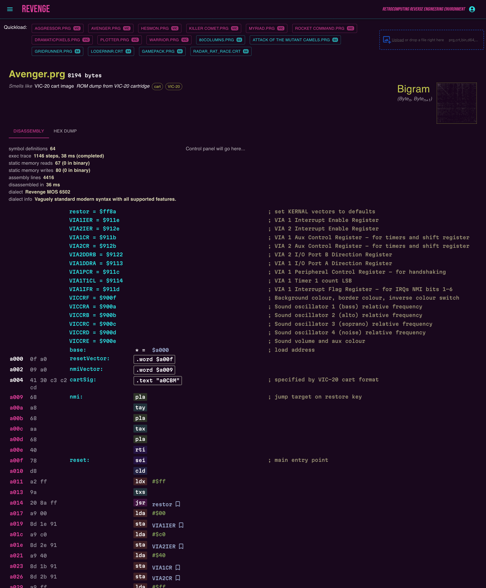

# Revenge

Reverse Engineering Environment


<!--suppress HtmlDeprecatedAttribute -->


The grand idea is a web-based reverse engineering environment for retro computers
with very small initial goals: binary file type detection and simple disassembly of
6502 machine code for the Vic-20 and C64. Z80 is a likely future supported architecture.

Beyond the small initial goals lies a vast land of unfulfilled wishes.

**Project Status**: _pre alpha_ (it sort of works with plenty left [TODO](TODO.md))

Currently the disassembler is fully automatic, although it identifies very few bytes
definitively as data. Binary content type (basic, machine code with basic stub, cart
image, etc.) is detected using heuristics and falls back to a hex dump if it can't
detect the filetype.



## Performance Problems April 2025

There is currently a terrible performance bottleneck in the front-end rendering causing
large binary loads to take a few seconds. Fixing it is a pretty high priority. It's
something dumb and will probably be quick to fix although I can imagine it taking a
whole day to find the cause. The disassembly and tracing (speculative machine code
simulation) together take less than 50ms and initial analysis shows it's something in
the rendering although the dev tools were unstable when I checked so I didn't get further
at that time.

## Architecture

Implemented in [TypeScript](https://www.typescriptlang.org/), using [Bun](https://bun.sh/),
[Vite](https://vite.dev/), [MUI](https://mui.com/), [React](https://react.dev/) and
[Mocha](https://mochajs.org/)/[Chai](https://www.chaijs.com/) for testing.

## Quick Start

After checking out this repo, from a shell in the root directory, run the sanity script
to check you have the relevant/recommended tools installed:

```shell
./sanity.sh
```

The main system is a single page web app with an optional server comonent which provides
access to retro binaries stored on the local filesystem a few are included in this
repo. Without the server, you can drag and drop files from your computer into the browser or click
the upload button. The plan for the server is to manage the state of interactive sessions
and provide access to a filetree of binaries for bulk analysis.

To run the server in its own shell, make sure you're in the `server` dir:

```shell
cd server
bun start
```

To run the client in its own shell, make sure you're in the `client` dir:

```shell
cd client
bun dev
```

The URL to point your browser to is shown in the console.

## System Design

Build and execution environment is `vite` for the client and `bun` for both client and server.
Node should also work with `npm` or `pnpm`. I'm not sure how to structure the project to be
transparently agnostic about this but if you have opinions and skills, get in touch and I will
accommodate any sane suggestions. To use `npm` or `pnpm`, check the `client/package.json` and
`server/package.json` files to see what scripts are defined.

## Features

* drag and drop file loading
* load file contents into summary view
* hex view (minimal)
* dumb disassembly - detection of code vs data is a project goal
* file type recognition
  * can recognise at least two types and offer to disassemble if it knows how
  * vic20 raw cartridge image recognition
  * BASIC programs
  * Machine code programs with a [Basic Stub](docs/basic-headers.md).
* representation of a syntax-independent assembler pseudo-op and Dialect can implement
  syntax-specifics
* assembly syntax highlighting
* Trace code paths to build call graph for detecting code vs data.
* Decode BASIC programs on VIC-20 and C64
* Test suite
* High quality reference data from the [c64ref](https://github.com/mist64/c64ref) project, initiated
  by [Michael Steil](https://pagetable.com/) of
  [The Ultimate C64 Talk](https://youtu.be/ZsRRCnque2E) fame.
* stats/summary of file interpretation action taken
  * execution time for disassembly
  * trace time
  * symbol detection count (disassembly)
* System kernal subroutine symbol recognition (VIC-20, C64)
* Visual plot of bi-gram frequency analysis of overlapping byte pairs in a binary. These
  are pretty good at visually distinguishing encrypted or compressed binaries. Machine code looks
  pretty different to BASIC.

## System Support Status

The design aims to reduce the effort of supporting multiple different systems, however at this
stage only VIC-20 and C64 carts, prg files and BASIC files have been tested and there is no
comprehensive test suite yet. Also, I'm not sure how feasible it would be to support some systems.
Within the communities of each system, different assembler tool chains are more prevalent.

In general, project scope includes support for 6502-based and Z80-based 80s Microcomputers and a
generous subset of the more common assembler syntax dialects. The following table shows
estimations, not promises.

| Machines                     | Status      | CPU Family |
|------------------------------|-------------|------------|
| VIC-20, C64                  | In Progress | 6502       |
| Apple II, BBC B              | Planned     | 6502       |
| NES, C128                    | Probable    | 6502       |
| ZX Spectrum & clones         | Planned     | Z80        |
| Microbee, TRS-80             | Probable    | Z80        |
| Oric, Atari 8-bit            | Probable    | 6502       | 
| VZ-200 / VZ-300 / Laser      | Probable    | Z80        |
| SNES                         | ?           | 6502       |
| Gameboy series               | ?           | Z80 -ish   |
| Vectrex, TRS-80 Coco, Dragon | ?           | 6809       |

## File Formats

Info on [binary file formats](docs/file-formats.md) is documented to guide the design of content
detection and disassembly.

## Assembly Dialects

See document about plans and ideas to support various
[assembler dialects](docs/assembler-dialects.md). Supporting a new dialect is a matter of
implementing the **Dialect** interface, possibly subclassing **BaseDialect**.

Currently only one arbitrary custom dialect is implemented while the API is being stabilised.

## Code Detection

It's not hard to make good guesses about what parts of a binary are code or data but it is harder to
do reliably and automatically. Therefore, most reverse engineering tools are interactive; the user
must get involved to interpret and understand the binary and to dictate what is code, text data,
image data, audio etc. and this is even trickier when code is self-modifying, compressed, encrypted,
obfuscated or when bytes are treated as both code and data.

Using a hybrid approach to code detection, some parts of a binary can be confidently identified as
code through a mixture of static and dynamic analysis. A `Tracer` is implemented which follows code
execution paths, including both sides of conditional branches and records which addresses hold
instructions. In many cases this approach can determine parts which are almost certainly code and
also to identify regions of almost certain data.

Work on this is ongoing.

Solving this problem deterministically for all possible programs is equivalent to solving
[The Halting Problem](https://en.wikipedia.org/wiki/Halting_problem) which has been famously proved
to be impossible. Solving it deterministically for certain programs, constrained to a useful subset
of possible instructions is at an early stage of implementation and further work to extend this with
partial evaluation and probabilistic execution could be very useful for accelerating reverse
engineering on small retro systems.

Using a combination of preemptive emulation, detailed machine architecture definitions and static
analytic techniques like program transformation, escape analysis, peephole optimisation and dynamic
techniques like speculative partial execution, combined with a large cross-referenced database built
from a corpus of known software, I hope to give insight to a human reverse engineer about any
software written for these enigmatic retro systems.

Read more notes about [Dynamic Analysis](docs/dynamic-analysis.md).

It may also be useful to use LLMs to help interpret code although I haven't begun to integrate
such a system.

## Design Notes

Machine language BASIC loaders often use base 10 data sequences of bytes. This is a low compression
format. Higher radix formats can be used as strings, rem comments or some other transport format and
the encoding of the instruction data can be a custom, variable-length compression format.

Peep-hole optimiser.
See [documented optimisations](https://www.nesdev.org/wiki/6502_assembly_optimisations).

Patchy comprehensions - in a given disassembly, is the byte literal treated as a zero-page address?
If so, or if it is a 16-bit address for, say, a load or store, is there some kernal symbol for that
address or is it a JSR destination?

Run small trial executions in the background to score various areas as code or data. Detect code
sequences that modify code (self-modifying code is harder to understand, although if the only change
during simulation is to a memory address that is read from, and not thereafter jumped to or used as
an index for a branch, signs point to likely separation between code and data).

Try to make this multipronged analysis somewhat automatic so the user can just confirm simple
hunches or heuristic interpretations.

### Pattern Recogniser and Macro Synthesiser

* The long conditional branch, [64tass supports it](https://tass64.sourceforge.net/#branch-long)
* Register stack save, restore
* Infinite unconditional loop
* Block of zeroes
* Block of pattern repeat

### Canonicalisation

There are different ways to represent data and code which are equivalent. A canonical form functions
as a single representation into which any variation can be transformed for the purpose of deciding
equivalence and should help in identifying behaviour, optimisation, deobfuscation and porting.

The canonical form of a piece of interpreted data enables divergent yet semantically equivalent
forms to be recognised. In the case of character data, the canonical form might make the reverse
form equivalent. In the case of code, the canonical form will have equivalences that, for example
use the y register instead of the x register, all else being equal. Canonical forms for code may
execute in a different number of cycles or use a different number of bytes or have instructions in a
different order (some design is required to analyse alternate orderings with preservation of
semantics).

## Interactive Disassembly

While as much detection as possible is ideal, detection cannot be perfect and all designation
options should be selectable by the user.

* Mark self-modifying code
* Mark block or line
* Macro extraction
* Expression synthesis
* Symbol definition
* Comments, labels, alternate literal forms including escape characters

## Reverse Engineering Tools

* [Radare2](https://github.com/radareorg/radare2) Unix-like reverse engineering framework and
  command-line toolset
* [Ghidra](https://github.com/NationalSecurityAgency/ghidra) by NSA (supports 6502 and dozens of
  more contemporary architectures)
* [Cutter](https://github.com/rizinorg/cutter) non-boomer UI
* [Binary Ninja](https://binary.ninja/) proprietary but has free cloud version that claims to
  support 6502 (I couldn't make it work) see my GH
  issue [#152](https://github.com/Vector35/binaryninja-cloud-public/issues/152)
* [IDA Pro](https://hex-rays.com/ida-pro/) classic, proprietary, native

## Useful Resources Documented Here

* [Reverse Engineering](docs/references.md) references
* [retro assembler dialects](docs/assembler-dialects.md)
